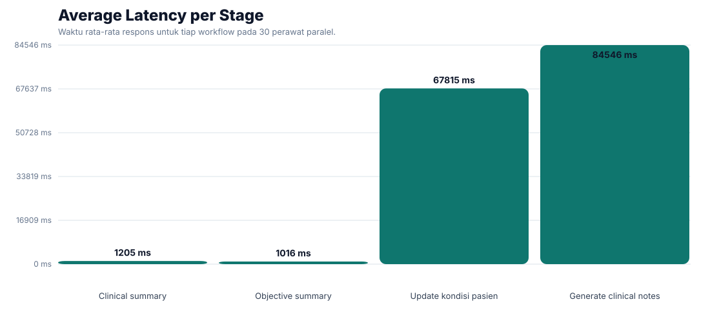
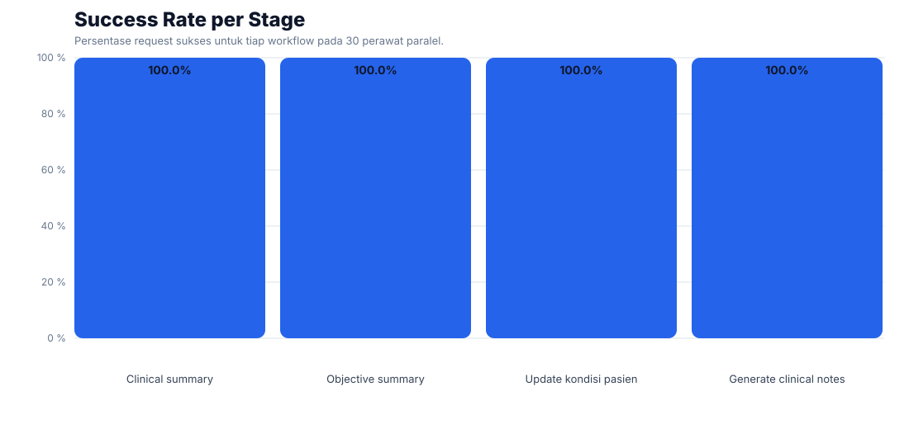

# Workflow Test Report

- Started: 2026-06-09T08:26:46.646Z
- Finished: 2026-06-09T08:30:48.879Z
- Base URL: http://127.0.0.1:3002
- Nurses tested: 30
- Scenarios: Clinical summary, Objective summary, Update kondisi pasien, Generate clinical notes

## Summary

| Stage | Count | Success Rate | Avg Latency | P95 Latency | Tools Observed |
|---|---:|---:|---:|---:|---|
| Clinical summary | 30 | 100.0% | 1205 ms | 1226 ms | clinical_summary |
| Objective summary | 30 | 100.0% | 1016 ms | 1040 ms | external_examinations_objective_summary |
| Update kondisi pasien | 30 | 100.0% | 67815 ms | 102366 ms | clinical_notes_chat_update |
| Generate clinical notes | 30 | 100.0% | 84546 ms | 124121 ms | - |

## Audit

| Log Type | Count |
|---|---:|
| agent_interaction_logs | 120 |
| agent_data_source_logs | 480 |
| agent_performance_logs | 120 |

## Per Nurse

| Nurse | Patient | Login | Summary | Objective | Update | Generate | Total Latency |
|---|---|---|---|---|---|---|---:|
| arga | Budi Santoso | OK | OK | OK | OK | OK | 133796 ms |
| nisa | Ayu Lestari | OK | OK | OK | OK | OK | 89350 ms |
| rafi | Rizal Maulana | OK | OK | OK | OK | OK | 115658 ms |
| dinda | Maya Permata | OK | OK | OK | OK | OK | 115227 ms |
| bagas | Dimas Prakoso | OK | OK | OK | OK | OK | 129761 ms |
| putri | Sari Wulandari | OK | OK | OK | OK | OK | 132681 ms |
| ilham | Hendra Wijaya | OK | OK | OK | OK | OK | 179483 ms |
| ratih | Nina Safitri | OK | OK | OK | OK | OK | 199295 ms |
| fajar | Agus Kurniawan | OK | OK | OK | OK | OK | 112853 ms |
| tiara | Rina Anggraini | OK | OK | OK | OK | OK | 104161 ms |
| galih | Fahmi Hidayat | OK | OK | OK | OK | OK | 78590 ms |
| anisa | Lia Kartika | OK | OK | OK | OK | OK | 103445 ms |
| rizky | Teguh Saputra | OK | OK | OK | OK | OK | 158102 ms |
| fitri | Vina Maharani | OK | OK | OK | OK | OK | 123527 ms |
| yudha | Yusuf Akbar | OK | OK | OK | OK | OK | 165479 ms |
| linda | Tika Amelia | OK | OK | OK | OK | OK | 174061 ms |
| arif | Fajar Nugroho | OK | OK | OK | OK | OK | 183565 ms |
| vina | Dewi Cahyani | OK | OK | OK | OK | OK | 215403 ms |
| faris | Rangga Setiawan | OK | OK | OK | OK | OK | 167948 ms |
| desi | Anisa Rahma | OK | OK | OK | OK | OK | 193866 ms |
| alif | Iqbal Ramadhan | OK | OK | OK | OK | OK | 174441 ms |
| intan | Putri Noviana | OK | OK | OK | OK | OK | 235894 ms |
| hafiz | Bayu Firmansyah | OK | OK | OK | OK | OK | 225323 ms |
| dewi | Citra Damayanti | OK | OK | OK | OK | OK | 232140 ms |
| ridwan | Ilham Pratama | OK | OK | OK | OK | OK | 170305 ms |
| melati | Nadia Fitriani | OK | OK | OK | OK | OK | 211820 ms |
| farhan | Arif Rahman | OK | OK | OK | OK | OK | 236503 ms |
| ayu | Sinta Melani | OK | OK | OK | OK | OK | 226534 ms |
| fikri | Galih Wicaksono | OK | OK | OK | OK | OK | 242057 ms |
| zahra | Zahra Oktavia | OK | OK | OK | OK | OK | 157782 ms |

## Charts

